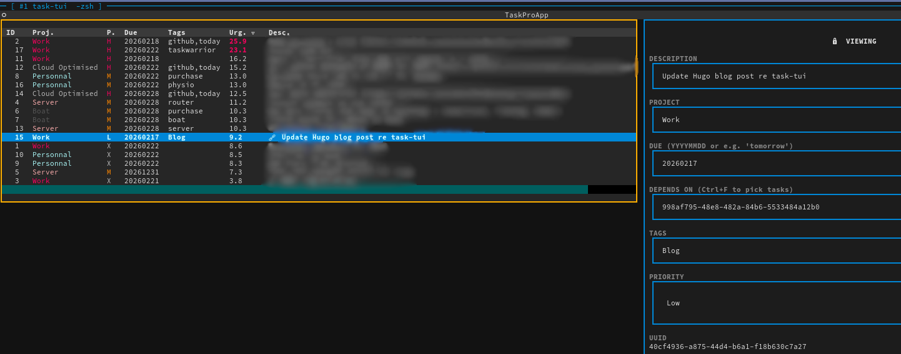

# 📝 Task-TUI

A modern, high-performance Terminal User Interface (TUI) for [Taskwarrior](https://taskwarrior.org/). Built with the Python [Textual](https://textual.textualize.io/) framework, it provides a seamless way to manage your tasks with live updates and fuzzy searching.



---

## ✨ Features

- **Live Preview & Interaction**: Browse your task list with Vim-like navigation; the editor panel updates instantly to show full task details.
- **Dynamic Color Hashing**: Automatically assigns one of 32+ unique colors to each **Project** name for instant visual grouping.
- **Urgency Alerts**: Task **Urgency** values above 20 are highlighted in **bold red** to help you focus on critical items.
- **Fuzzy Search & Dependency Picking**:
  - Press `/` to search all pending tasks.
  - While editing dependencies, press `/` to search and pick tasks to add to the dependency list.
- **Dependency Explorer**: Press `v` to open a dedicated modal showing all tasks the current item depends on, with the ability to "jump" directly to them.
- **Contextual Quick-Actions**: Rapidly set Due Dates (Today, Tomorrow, End of Week/Month) or Priority levels without entering full edit mode.
- **Visual Priority**: Priority levels are color-coded (High = Red, Medium = Yellow, Low = Green).
- **Auto-Sync**: Automatically runs `task sync` on startup and exit to keep your remote servers up to date.

---

## 🚀 Installation

### Prerequisites

- Python 3.10+
- [Taskwarrior](https://taskwarrior.org/download/) installed and configured in your `PATH`.

### Stable release (recommended)

Install the latest release directly from GitHub:

```bash
pip install https://github.com/lbesnard/task-tui/releases/latest/download/task_tui-$(curl -s https://api.github.com/repos/lbesnard/task-tui/releases/latest | grep -Po '"tag_name": "v\K[^"]+').whl
```

Or pick a specific version from the [Releases page](https://github.com/lbesnard/task-tui/releases) and install it directly:

```bash
pip install https://github.com/lbesnard/task-tui/releases/download/v1.0.0/task_tui-1.0.0-py3-none-any.whl
```

### Via pipx (isolated environment — great for CLI tools)

```bash
pipx install https://github.com/lbesnard/task-tui/releases/latest/download/task_tui-$(curl -s https://api.github.com/repos/lbesnard/task-tui/releases/latest | grep -Po '"tag_name": "v\K[^"]+').whl
```

### Latest from source

```bash
pip install git+https://github.com/lbesnard/task-tui.git
```

### Development install

1. Clone the repository:

```bash
git clone https://github.com/lbesnard/task-tui.git
cd task-tui
```

2. Install in editable mode:

```bash
pip install -e .
```

---

## ⌨️ Keyboard Shortcuts

### 1. Navigation & Global

| Key       | Action                         |
| :-------- | :----------------------------- |
| `j` / `k` | Navigate task list (Vim-style) |
| `g` / `G` | Jump to Top / Bottom of list   |
| `/`       | Open Fuzzy Search              |
| `r`       | Refresh task list              |
| `u`       | Undo last Taskwarrior action   |
| `q`       | Quit and Sync                  |

### 2. Task Quick-Actions

| Key     | Action                                                 |
| :------ | :----------------------------------------------------- |
| `i`     | **Modify**: Enter Edit Mode for selected task          |
| `n`     | **New**: Create a new task                             |
| `x`     | **Save**: Save changes (works while focused in inputs) |
| `s`     | **Start/Stop**: Toggle active status on a task         |
| `d`     | **Done**: Mark selected task as completed              |
| `v`     | **View Deps**: Open the Dependency Explorer modal      |
| `space` | **Select**: Toggle task for batch operations           |

### 3. Quick Context Menus

| Key   | Action                                                    |
| :---- | :-------------------------------------------------------- |
| `t`   | **Quick Date**: Set due date (Today, Tomorrow, EOW, etc.) |
| `p`   | **Quick Prio**: Set priority (High, Mid, Low, Clear)      |
| `Esc` | Cancel context menu or Edit Mode                          |

---

## 🛠 Configuration

Task-TUI reads directly from your `.taskrc`, and now also supports an optional app config file.

On first run, Task-TUI creates:

`~/.local/share/task-tui/config.json`

You can customize keyboard shortcuts and future UI settings there. Example:

```json
{
  "shortcuts": {
    "global_search": "/",
    "dependency_search": "/",
    "edit_mode": "i",
    "save_task": "x"
  },
  "ui": {
    "show_debug_panel": true
  }
}
```

If you have a `taskserver` configured, Task-TUI will attempt to sync your changes automatically when you close the application.
